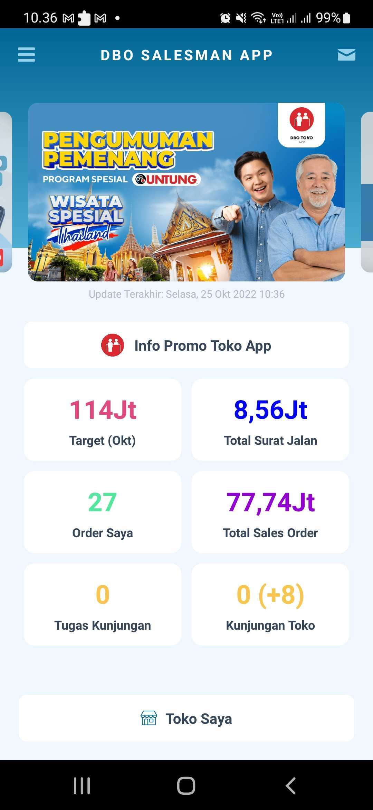

<h1 align="center">SALESMAN DBO APP</h1>

## Descriptions

A mobile app for your salesman to complete their daily activities, and is also connected to the Manager App so you can analyze their results anytime.

## FEATURE IMAGES/SCREENSHOT

  

## Technologies Used

### Prerequisites

[![Node version][shield-npm]](#)
[![Node version][shield-yarn]](#)
[![Node version][shield-homebrew]](#)
[![Node version][shield-node]](#)
[![Node.js version support][shield-watchman]](#)
[![Build status][shield-xcode]](#)
[![Code coverage][shield-cocoapods]](#)
[![Dependencies][shield-jdk]](#)
[![MIT licensed][shield-android-studio]](#)
[![MIT licensed][shield-android-sdk]](#)

[shield-npm]: https://img.shields.io/badge/NPM-6.14.17-brightgreen
[shield-yarn]: https://img.shields.io/badge/Yarn-1.22.19-brightgreen
[shield-homebrew]: https://img.shields.io/badge/Homebrew-3.5.6-brightgreen
[shield-node]: https://img.shields.io/badge/Node-v14.19.2-brightgreen
[shield-watchman]: https://img.shields.io/badge/Watchman-2022.07.04.00-brightgreen
[shield-xcode]: https://img.shields.io/badge/Xcode-13.2.1-brightgreen
[shield-cocoapods]: https://img.shields.io/badge/Cocoapods-1.11.3-brightgreen
[shield-jdk]: https://img.shields.io/badge/JDK-%3E%2011-brightgreen
[shield-android-studio]: https://img.shields.io/badge/android%20studio----brightgreen
[shield-android-sdk]: https://img.shields.io/badge/Android%20SDK-29-brightgreen

### Info App

| App                  | Using        |
| -------------------- | ------------ |
| Framework            | React Native |
| Programming Language | Typescript   |

## Cloning and Running the Application in local

Clone the project into local
`git clone git@bitbucket.org:admin_dbo/mobile-salesman-service.git` to clone the project to your local environment. You can also download the project manually by choosing the `mobile-salesman-service` branch and download the `zip` file.

### Installation

1. npm install ( to install dependencies)
2. yarn

### Setup environments

The template already has scripts to execute the project calling a specific environment defined into the package.json file. Keep in mind that if you are going to create new `envs` you have to define the script to build the project properly.

To define which env you want to use, just keep the structure `yarn [environment]`

DEV: `yarn dev`

STG: `yarn staging`

PROD: `yarn prod`

Modify the environment variables files in root folder (`.env.development`,`.env.staging` and `.env.production`)

## Status

DBO Salesman app is still in progress.
